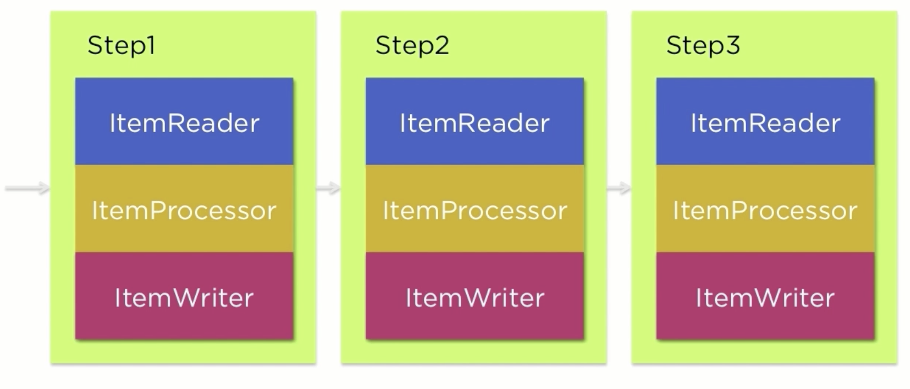

## Learn Spring Batch

#### Simple HelloWorld Job and it's Step
Steps:
* Select a Sprint Batch dependency from IO section in start.spring.io
* Create a `@Configuration` class which also `@EnableBatchProcessing` boot strapping the Spring Batch
```java
import org.springframework.batch.core.configuration.annotation.EnableBatchProcessing;
import org.springframework.context.annotation.Configuration;

@Configuration
@EnableBatchProcessing
public class BatchJobConfiguration {
}
``` 
* `@Autowired` the `JobBuilderFactory` and `StepBuilderFactory` in the `@Configuration` class
* Create a `Step` bean which uses a `StepBuilderFactory` to create a `Tasklet`
```java
@Bean
public Step step1() {
    return stepBuilderFactory
            .get("step1")
            .tasklet(new Tasklet() {
                @Override
                public RepeatStatus execute(StepContribution stepContribution, ChunkContext chunkContext) throws Exception {
                    System.out.println("Hello World!");
                    return RepeatStatus.FINISHED;
                }
            })
            .build();

}
```
* Create a `Job` and use the `Step` for execution as shown below.
```java
@Bean
public Job helloWorldJob() {
    return jobBuilderFactory
            .get("helloWorldJob")
            .start(step1())
            .build();
}
```

**The Job:** Defines the flow that the processing will take through those states.
Each Step represents the State with in the State machine. So the Job defines
the list of states and how to transition from one state to another.  

**The Step**: Represents independent piece of processing that makes up a job. A job may have many steps.  
There are two different types of Steps.  

* **`Tasklet`** is a single method interface which contains `execute()`. Spring Batch provides a single method within the 
scope of the transaction.  

* **`Chunk`** is a Item based step. When you look at the Chunk step we expect to be processing Items individually.
Within the type of this Step there are three main components.
    * `ItemReader` is responsible for all the inputs for this `Step`
    * `ItemProcessor` which is optional; provides any additional transformation / validation / logic that needs to be applied on each Item
    * `ItemWriter` is responsible for output of the Step
 



For executing job, Spring Batch expects DB to be configured to maintain a JobRepository. For Test scope, it uses Map based Job store.

```properties
spring.datasource.driverClassName=com.mysql.jdbc.Driver
#spring.datasource.schema=schema-mysql

## If you are getting this error Table 'BATCH_JOB_INSTANCE' doesn't exist
## use this property
spring.batch.initialize-schema=ALWAYS
spring.datasource.url=jdbc:mysql://localhost:3306/learn_spring_batch
spring.datasource.username=root
spring.datasource.password=root
```

Spring Batch Tables


Refer Classes in this order:
* `SimpleHelloWorldBatchJobConfiguration`
* `StepTranstionConfiguration`
* `FlowConfiguration`, `FlowFirstConfiguration`
* `SplitConfiguration`, `BatchConfiguration`
* `DecisionBatchConfiguration`
* `ParentJobConfiguration`, `ChildJobConfiguration`, `README.md` and `application.properties`
* `ChunkListener`, `JobListener`, `ListenerJobConfiguration`, `README.md` and `application.properties`
* How to supply param to the Job Step: `JobParamConfiguration`

### Item Reader
* Read Data from Database: `JobConfigurationToReadDataFromDB`, `CustomerRowMapper`, `Customer` and `data-mysql.sql`, `schema-mysql.sql`
* Read Flat file: `JobConfigurationToReadFlatCsvFile`, `CustomerFieldSetMapper`, `customer.csv`
* Read XML file: `JobConfigurationToReadXmlFile`, `customer.xml`
* Read Multiple CSV files sequentially: `JobConfigurationToReadMultipleCsvFiles`, `CustomerFieldSetMapper`, `Customer1` and `multi-file/customer*.csv`
* Stateful Item Reader: `JobConfigurationWithStateful`, `StatefulItemReader`
* Stateless Item Reader: `JobConfigurationWithStateless`, `StatelessItemReader`

### Item Writer
* Write content to System Out using ItemWriter: `JobConfigurationToWriteToSystemOut`, `SysOutItemWriter`
* Write content to Database using JdbcBatchItemWriter: `JobConfigurationToWriteContentToDb`, `CustomerFieldSetMapper`, `customer.csv`, `Customer`, `data-mysql.sql`
* Write content to Flat files using FlatFileItemWriter: `JobConfigurationToWriteContentToFlatFile`, `CustomerLineAggregator`
* Write content to XML format using StaxEventItemWriter: `JobConfigurationToWriteContentToXmlFile`
* Write content to Multiple Destination: 
    * Read the Date from the Database
    * How to write the same content in two different file format JSON and XML using `CompositeItemWriter` which different `ItemWriter` for our use case 
    * How to write content based on business decisions using `ClassifierCompositeItemWriter`
        * ODD Ids should go to JSON
        * Even Ids should go to XML
    * Refer: `JobConfigurationToWriteContentToMultipleFileFormat`, `CustomerClassifier`

### Item Processor
* How to do business logic using `ItemProcessor` for an `Item` which we read using `ItemReader`
    * `JobConfigurationToDoUpperCaseItemProcessor`, `UpperCaseItemProcessor`
* How to do Filtering Item (if Item id is Even number just skip): `JobConfigurationToDoFilterRecordsUsingItemProcessor`, `FilteringItemProcessor`
* How to validate an Item?: `JobConfigurationToValidateItemInput`, `CustomerValidator`
* How to do multiple actions with in the `ItemProcess` and usage of `CompositeItemProcessor`?
    * Using `CompositeItemProcessor`, you can build a nice chain of `ItemProcessor` implementation and control it's execution order.
    * Refer: `JobConfigurationUsingCompositeItemProcessor`
    
### How to handle Errors and Scale Applications
* How to handle the `restart` the job where it left off?
    * Let's say that we have 2 step job.
    * When you run your application first time Step1 will be FAILED
    * When you run your application second time Step1 will be SUCCEED and Step2 will be FAILED
    * When you run your application third time Step1 will be SKIPPED and Step2 will start continue where it left.
    * Refer `JobConfigurationWithRestart`
    
* How to handle the `retry` mechanism in your job configuration?
    * Let's say you have a job which contains some steps.
    * Each step consists of `reader`, `processor`, `writer` logic.
    * Let's assume during the `reader` logic, you are trying to read data from database. However, it's not working, 
    then you have to handle this that how many time (15 times) you are going to hit database to establish a connection to continue
    the read activity. However after tried 15 times, it would throw an exception that something really not working.
    * The same will also applicable for `writer` logic. Its upto the business use case how to control your job flow.
    * Refer package `job.retry` classes.
        * This Job configuration by default would execute the job steps successfully.
        * However, if you pass application argument like `retry=processor`, after 5 retry, finally job will be executed 
        successfully.
        * Let's pass the application argument like `retry=writer`, to test the writer retry. After 5 retry, the job will
        be executed successfully.
        
* How to handle the `skip` mechanism in your job configuration?
    * Suppose you are receiving a file for batch processing
    * During the processing, something records has been skipped by job. Which is acceptable. However, if you are skipping
    many records, then fundamentally problem with the input file.
    * During the `Step` logic we have to use `skip()` and `skipLimit()`
    * Refer package `job.skip`
        * When you run your application first time, it will run your step and job successfully. Nothing will be skipped.
        * However, if you pass application argument like `skip=processor`, after 5 retry, finally job will be executed 
        successfully.
        * Let's pass the application argument like `skip=writer`, to test the writer retry. After 5 retry, the job will
        be executed successfully.
        
* How to handle Errors - Listeners?
    * In previous examples, we have developed `retry` and `skip` logic.
    * However, skipping the records from job processing is not a good option.
    * Spring Batch provides a option to track the `skip`ed records using Listeners.
    * For `ItemProcessor` logic - Listeners will be executed after the chunk processed.
    * For `ItemWriter` logic -  Listeners will be executed on each Item basics.
    * Refer package `job.listener`
    
* How to Scaling Spring Batch Applications?
    * In order to process million or billion of records using Spring Batch application, we have to scale each steps
    in order to achieve this.
    * What are the options available?
        * Multi-Threaded Step
        * Async ItemProcessor / Async ItemWriter  
        * Partitioning
        * Remote Chunking
    * **Multiple Threads**
        * In this case by adding a task executed to our step Spring Batch executes each chunk within its own thread.
        * If I have million records to process and the chunk size is 1000 and I add a task execute or that exposes 
        four threads instead of processing 1000 records at a time I will be processing 4000 records at a time.
        * 1000 record chunks four of them running in parallel the async item processor in combination with the 
    * **`Async ItemReader` and `Async ItemProcessor`**
        * Async ItemReader is another option here. The ItemProcessor returns a `Future` the actual processor logic itself
        is executed on another thread and then when the thread returns a.k.a the `Future` returns the `ItemWriter` unwraps
        the Future and persists the data.
        * This allows for scalability of the processor logic within a single JVM.
    * **Partitioning**
        * Partitioning is another option. In partitioning we actually divide the data into partitions and then those
        partitions are processed in parallel.
        * Let's say I have got a million records and I partition them in chunks of 100000.
        * So partition 1 is record 1..100000 and partition 2 is record 100001..200000 and so on.
        * I can scale up the parallelization of that as large as I want. I can either use threads to execute those
        partitions in parallel very similar to how a multi threaded step is executed or I can execute them remotely 
        via remote partitioning.
        * This allows me to span multiple JVMs and having master slave configuration where the master tells the slaves you 
        execute partition one; you execute partition 2; you execute partition 3 and so on.
        * The advantage partitioning has over say a regular multi threaded step is that each partition is executed as an
        independent step execution.
        * Because of this you get the same restart ability as well as thread safety that you'd have within a regular step
        that you lose in multi threaded step.
    * **Remote Chunking**
        * Here the processing and writing phases of the step occur in a slave. 
        * So instead of a partitioned aspect where I have the slave doing the reading the processing and the writing for
        remote chunking the read is done by the master.  
        * The data is read and passed to a slave where the processing and writing occur.
        * One important thing note with partitioning when you have to master slave configuration the master is only 
        sending over a description of what the process to the slaves.
        * So the master is only saying process 1: records 1..100000 and process2: 100001..200000
        * Just that metadata is all that is passed from master to slave and back yet with remote chunking the actual
        data goes over the wire.
        * So here instead of saying to the slave process records 1..100000; The master actually reads those records and
        passes the individual records over the wire.
        * This is a much more IO intensive option so the processing really needs to be the bottleneck in order for this
        to be a productive option.
    * **Examples**
        * Refer this package `scale.multithread`
        * Refer this package `scale.async`
        * Refer this package `scale.loalpartition`
        * Refer this package `scale.remotepartition`
            * In order to illustrate this build this application
            * Scenario 1:
                * Slave app: `java -jar -Dspring.profiles.active=slave app.jar`
                * Master app: `java -jar -Dspring.prifiles.active=master app.jar`
            * Scenario 2:
                * Slave app1: `java -jar -Dspring.profiles.active=slave app.jar`
                * Slave app2: `java -jar -Dspring.profiles.active=slave app.jar`
                * Master app: `java -jar -Dspring.prifiles.active=master app.jar`
        * Refer this package `scale.chunking`
            * In order to illustrate this build this application
             * Scenario 1:
                 * Slave app: `java -jar -Dspring.profiles.active=slave app.jar`
                 * Master app: `java -jar -Dspring.prifiles.active=master app.jar`
             * Scenario 2:
                 * Slave app1: `java -jar -Dspring.profiles.active=slave app.jar`
                 * Slave app2: `java -jar -Dspring.profiles.active=slave app.jar`
                 * Master app: `java -jar -Dspring.prifiles.active=master app.jar`

### Spring Batch - Job Orchestration & Spring Integration    

* How to start a job by trigger through a REST controller?
    * Refer package `integration.startajob`
        * Add/Enable entry in `application.properties` called `spring.batch.job.enabled=false`
        * Refer end point `/scenario1` and `/scenario2`
      
* How to stop a job by trigger through a REST controller?
    * Refer package `integration.stopajob`
        * Start the application
        * Hit `/start-a-job` to start the job. Job will be executed continuously.
        * Hit `/stop-a-job/{id}` to supply the job execution id to stop the job.
        
* How to schedule a job using Spring Schedule?
    * Refer package `integration.schedule`
    
* How to launch a job via Messages?
    * Refer package `integration.message.launch`
        * Added additional integration dependencies
        * Added `@IntegrationComponentScan` at the application level.
        * Here in this example, we added listeners at job and chunk level to moritor job and chunk.
        * Message will be triggered at the beginning and end of job
        * Message will be triggered at the end of each chunk has been processed.
                    